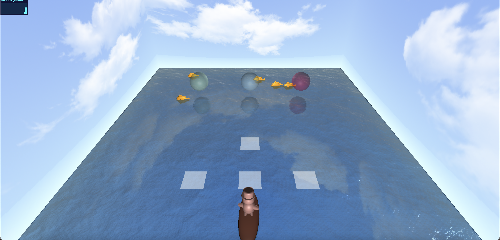

# Final Project

- Live: [https://michellewongi.github.io/Advanced_CC/final/dist/](https://michellewongi.github.io/Advanced_CC/final/dist/)

## Screenshot of my project

## Inspo

 

## Overview

For my final project, I made a 3D ocean landscape. For the backgrounds of the scene, I loaded images as a texture inside the cube. For creating the water component of my scene, I referenced (Ken Kozma's tutorial)[https://www.liquid.fish/current/threejs]. You can move the character around with the arrow keys. I added 3 spheres in the scene that will change the scene when the user comes in contact with them. The user can move the position of the fishes as a group using the white squares in the scene to position them.

## Technologies

- Three.js
- TypeScript
