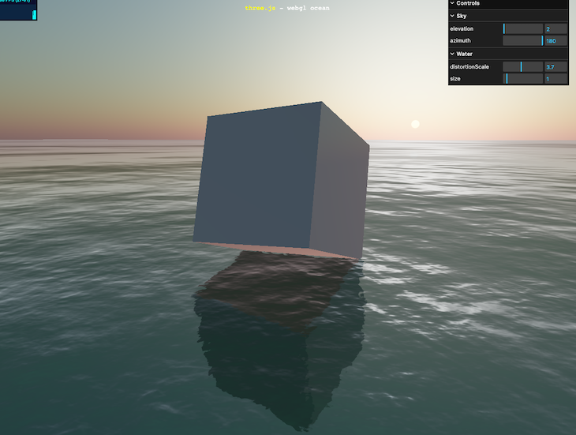
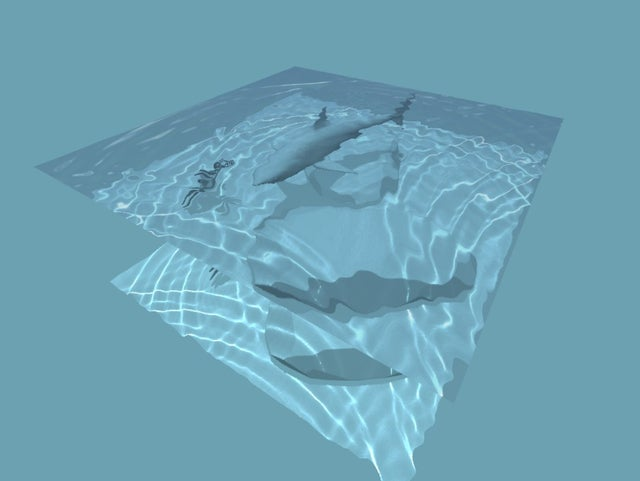
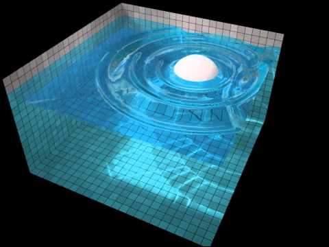

# Week 12: Final Concept

## Overview

For my final concept I wanted to create an interactive 3D scene. I wanted to have a character be able to navigate through the scene and I wanted to make a the environment on water. I'm planning on adding either GLTF/OBJ objects or three.js primitives throughout the scene that will respond to the character bumping into it like changing the color of the sky. I want to make this using Three.js and using the keyboard for interaction.

## Inspirations

## Anticipated Challenges

- Making the water look and move realistically

## Schedule

- Week of 4/18: Creating the scene and have all the objects within the scene done.

- Week of 4/25: Adding interaction between the objects in the scene.
